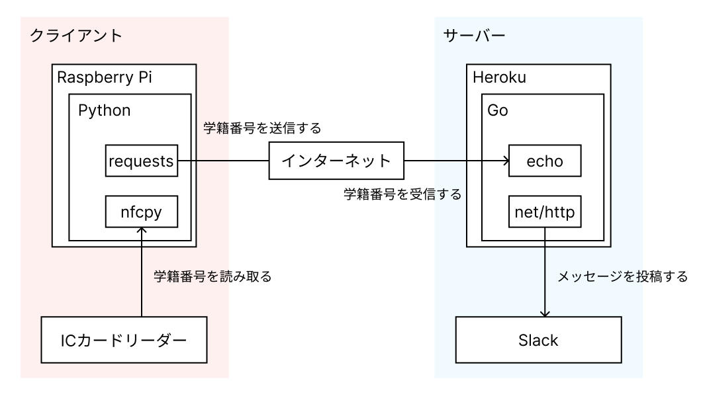

# 第0回 / 前置き

　この講座のゴールは「Monbanが運用できる程度の技術力を身につけること」です。しかしながら、具体的にどのようなことができるようになっていればMonbanが運用できるのでしょうか。本章ではMonbanの運用に必要な技術の全体像を示し、以降の章で何を学ぶのか、そしてそれらが何の役に立つのかを説明します。

### Monbanの構成

　まず、Monbanの構成図を図1に示します。なお、説明の中でサーバー、クライアントの単語が使われていますが、ここでは簡単のため、鯖室で動いているものをクライアント、鯖室ではない場所で動いているものをサーバーと呼ぶことにします。正確な定義は後ほど紹介します。

<figure><figcaption>
図1: Monbanの構成図（さすがに雑すぎるので気が向いたら変えるかも）
</figcaption></figure>

　この構成図をもとに、実際に学生証をICカードリーダーにかざしたときの動作を追ってみましょう。もしかしたらこの説明の中にはわからない箇所があるかもしれません。しかし、今はまだ理解できなくとも問題ありません。講座の途中でこの部分を見返し、自分の理解度を確認するために使うとよいでしょう。

1. 学生証をICカードリーダーにかざす
2. Raspberry Piで動いている、Pythonで書かれたプログラムが学籍番号を読み取る
3. 2のプログラムが、読み取った学籍番号をサーバーに送信する
4. サーバーで動いている、Goで書かれたプログラムが学籍番号を受信する
5. 4のプログラムが、Slackへメッセージを送信する
6. （4のプログラムが、時刻と学籍番号をデータベースに記録する）

　注意したいのは、サーバーとクライアントはそれぞれ別のコンピューターである、ということです。鯖室の入り口に置いてあるMonbanの装置（Raspberry PiとICカードリーダー）はクライアント側のみのもので、サーバー側の装置は鯖室にはありません。ではどこにあるのか、という話は講座の後の章ですることにします。

### 講座の構成

　本講座では、Monbanに関連する技術を学んでいくとともに、簡易的なMonbanを実装することでより深い理解を得てもらうことを目指します。そのため、本講座は以下の3つのパートに分けて書かれています。

#### PART 1: サーバーサイド

　このパートでは、サーバーサイド（構成図の青色の部分）について学びます。このパートを通して、特定のURL（たとえば`https://example.com?student_id=12345`）にアクセスすると、Slackにメッセージを投稿（たとえば`[2022/12/05 17:19:24] 学籍番号: 12345`）できるようにします。

　そのために、まずはAPIサーバーを構築します。このAPIサーバーはクライアントからのリクエストを待ち受け、リクエストがあったURLに対応した処理を行います。

　次に、Slackへメッセージを投稿する方法を学びます。そしてAPIサーバーと組み合わせることで、クライアントからリクエストが生じたときにSlackへメッセージを投稿できるようになります。

　最後に、ここまでで実装したものをデプロイ（Web上に公開）します。

#### PART 2: クライアントサイド

　このパートでは、クライアントサイド（構成図の赤色の部分）について学びます。このパートを通して、ICカードリーダーに学生証をかざしたときに、PART 1で作ったサーバーに学籍番号を投げられるようにします。

　そのために、まずはRaspberry Pi上で動作するLinuxの操作方法を学びます。特に、起動方法やファイル操作の方法を中心に取り上げます。

　つぎに、Raspberry PiからICカードリーダーを操作する方法を学びます。

　最後に、実際に鯖室のRaspberry Piを使って簡易的なMonbanを構築します。PART 1とPART 2で作ったものを組み合わせることで、学生証をかざしたときにSlackにメッセージを投稿できるようになります。

#### PART 3: 高度なトピック

　このパートでは、構成図に書かれていない、より複雑な部分について学びます。参加者の進度に応じて変更する予定ですが、いまのところデータベースを触ってもらおうと考えています。

### 参考文献

\[1] [https://sysken.org/blog/6229/](https://sysken.org/blog/6229/) （2022/12/05 参照）

