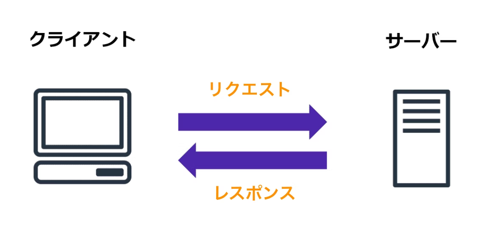

# 第1回 / 基礎知識


🔊 Web講座を過去に受講した人はこのページを読み飛ばして構いません（「Web入門」に相当する内容です）


### この章のゴール

　以下の事項について理解する。

* サーバークライアントモデル
* 3つの基本的な仕様
  * URL
  * HTTP
  * HTML

　さっそくPART 1に入りたいところですが、その前にWebに関する基礎知識を確認します。

### Webとは

　そもそもWeb（World Wide Web）とは一体何なのでしょうか。その起源に立ち返ると、1980年代にTim Berners-Leeらによって作成された"_WorldWideWeb: Proposal for a HyperText Project_"という提案書にたどり着きます。それから今日に至るまでにWebの世界では数々の改善・変更が行われてきましたが、基本的なコンセプトは変わっていません。**世界中に分散している情報をどこからでも閲覧・編集できるようにするためのシステム**が、Webと呼ばれるものです。

#### クライアントサーバーモデル

　Webの特徴の一つに、クライアントサーバーモデルに基づいて設計されていることが挙げられます。このモデルにおいては、何らかの機能を提供するサーバーと、その機能を利用するクライアントの二者に分かれて通信を行います。

<figure><figcaption><p>クライアントサーバーモデルの概略図 [2]</p></figcaption></figure>

　一般に私達、ユーザーはクライアントとして振る舞います。たとえばWebブラウザでWebサイトを閲覧する際には、サーバーにWebサイトの情報をリクエストし、返ってきたレスポンスを画面に表示することで、私達クライアントは情報を得ることができます。

　ところで、一言にWebブラウザと言っても現実には複数のブラウザが存在します。具体的には、Google Chrome、Safari、Firefoxなどです。これらは異なるソフトウェアですが、同じサイトを閲覧すると概ね同じ画面が表示されます（挙動が異なるWebサイト・Webブラウザも存在しますが、ここでは無視します）。これは、ほとんどのWebブラウザが同一の仕様に従ってWebサイトを取得・描画しているためです。

　数多くの仕様が策定されているためここですべてを紹介することはできませんが、基本的な3つの仕様のみを取り上げて紹介します。

#### URL (Uniform Resource Locator)

　URLは、Web上のある1つのリソースの場所を表現するための仕様です。[URL Standard](https://url.spec.whatwg.org/)で定義されています。

　たとえば、[https://example.com/index.html](https://example.com/index.html)のようなURLをWebブラウザに渡すことによって、ユーザーは自分が見たいリソースを指定することができます。


本講義では何回か[https://example.com](https://example.com)というURLが登場します。実はこれも仕様の一つで、文書の中でURLを例示するときのために予約されています。


　ここでのリソースとは、以下に列挙したものなどを指しています。

* HTMLファイル
* JavaScriptファイル
* CSSファイル
* 画像ファイル
* 動画ファイル
* 音声ファイル

#### HTTP (HyperText Transfer Protocol)

　Webブラウザとサーバーが通信するためのプロトコルです。クライアントからサーバーへ送信されるデータをリクエスト、逆にサーバーからクライアントへ送信されるデータをレスポンスと呼びます。

　HTTPにはいくつかのバージョンがありますが、HTTP/1.1を用いた場合の通信内容を見てみましょう。Webブラウザでhttps://example.comにアクセスすると、以下のようなデータがやり取りされます（簡単のため一部のデータを省略しています）。

リクエスト（クライアント→サーバー）

```
GET / HTTP/1.1
Host: example.com


```

| データ                 | 意味                                               |
| ------------------- | ------------------------------------------------ |
| `GET`               | HTTPメソッド（リクエストの種類）を指定します。GETのほか、POST、PUTなどがあります。 |
| `/`                 | リソースの場所を指定します。                                   |
| `HTTP/1.1`          | HTTPのバージョンを指定します。                                |
| `Host: example.com` | リスクエスト先のサーバーを指定します。                              |

レスポンス（サーバー→クライアント）

<pre><code>HTTP/1.1 200 OK
Content-Type: text/html; charset=UTF-8
Date: Mon, 05 Dec 2022 09:05:34 GMT

<strong>&#x3C;!doctype html>
</strong>&#x3C;html>
&#x3C;head>
(省略）
</code></pre>

| データ                                      | 意味                                                                                                                    |
| ---------------------------------------- | --------------------------------------------------------------------------------------------------------------------- |
| `HTTP/1.1`                               | HTTPのバージョンを表します。                                                                                                      |
| `200`                                    | HTTPステータスコードを数字で表します。意味は[https://gist.github.com/rosylilly/3401612](https://gist.github.com/rosylilly/3401612)を参照のこと。 |
| `OK`                                     | HTTPステータスメッセージを表します。同上。                                                                                               |
| `Content-Type: text/html; charset=UTF-8` | データの種類を表します。HTMLファイル（`text/html`）を文字コードUTF-8（`UTF-8`）で送ることを表しています。                                                    |
| `Date: Mon, 05 Dec 2022 09:05:34 GMT`    | レスポンスを送信した日時を表します。                                                                                                    |
| `<!doctype html>`以下                      | 送信するHTMLファイルの内容を表しています。                                                                                               |

#### HTML (HyperText Markup Language)

　HTTPによってやり取りされる、Webページの内容を表現するデータ構造です。マークアップ言語の一つで、文字データに文書構造や装飾を付加することを目的としています。

### 演習


このセクションでは、実際に手を動かすことで理解を深められると判断したことについて演習を課しています。簡易的なMonbanの実装もこのセクションに記述されます。ただし、強制ではないので、取り組まなくてもよいです。


#### 1. 実際のHTTP通信をGoogle Chromeで確認する

　Google Chromeには、開発者向けのDevToolsと呼ばれる機能が実装されています。[https://example.com](https://example.com) にアクセスして、F12キーを押すと次のような画面が表示されます。&#x20;

<figure><figcaption><p>右側に表示されているのがDevTools</p></figcaption></figure>

　なにやらカラフルな文字列が右側に表示されていますが、これが今見ているWebページのHTMLファイルです。

　また、DevToolsの上のタブから"Network"を選択し、ページを更新してみましょう。次のような画面が表示されるはずです。

<figure><figcaption><p>Networkタブを開いたときの画面</p></figcaption></figure>

　このタブでは、Webページを開いてから送信された通信（先ほど説明したHTTP通信も含む）の一覧を確認することができます。調べたい通信をクリックすると詳細を確認できます。

<figure><figcaption><p>HTTP通信の詳細</p></figcaption></figure>

　さきほど例示したHTTP通信と比較して、HTTPメソッドやHTTPステータスコードなどが同じことがわかります（Request Method: GET、Status Code: 200など）。

　以上で紹介したDevToolsの機能を使って、他のWebページで行われる通信を確認してみましょう。特にWebページが思いつかなければ、[https://www.tsuyama-ct.ac.jp/](https://www.tsuyama-ct.ac.jp/)や[http://abehiroshi.la.coocan.jp/](http://abehiroshi.la.coocan.jp/)を使ってみるとよいです。

#### 2. HTTP通信を手で送受信する

// TODO: Windowsだとできないらしいので後回し

### 参考文献

\[1] 米内貴志、『Webブラウザセキュリティ Webアプリケーションの安全性を支える仕組みを整理する』、ラムダノート（2022）

\[2] [https://qiita.com/atsushi729/items/52c8ede9f09d08dc84e6](https://qiita.com/atsushi729/items/52c8ede9f09d08dc84e6) （2022/12/05 参照）
